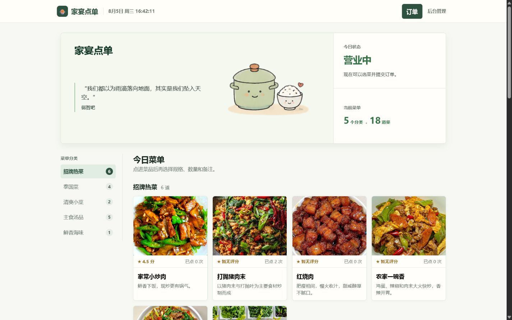
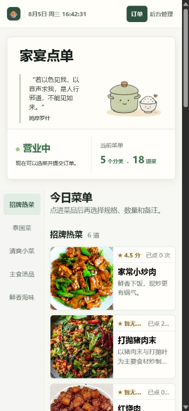
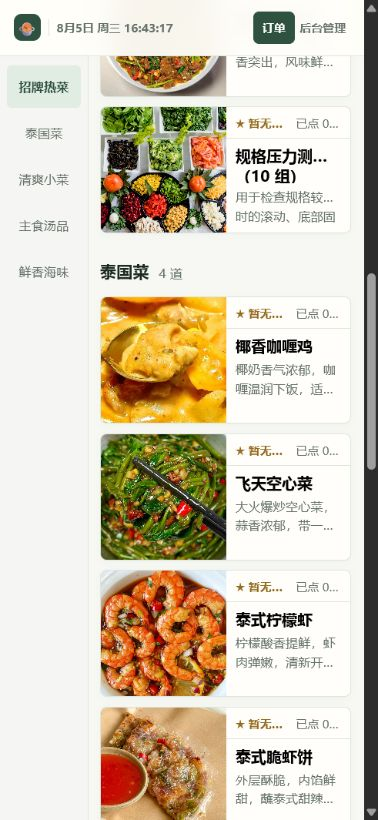
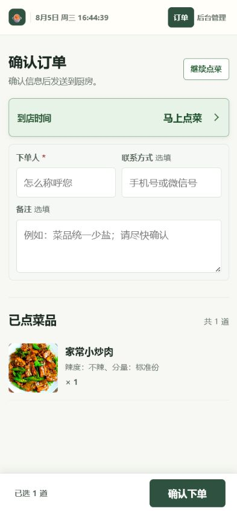

# 家宴点单 Family Table

<p align="center">
  
</p>

一个面向家庭和小型聚餐场景的轻量点菜、预约与订单管理服务。访客无需注册即可浏览菜单、选择规格、提交点单；管理员在同一个站点中维护菜单、处理订单，并可在新订单到来时接收企业微信通知。

项目不包含价格、支付、收银、库存与多角色权限，聚焦家庭与小型聚餐场景，适合单人维护，可部署在 NAS 或一台小服务器上。

## v0.2.2

本版本调整登录 Cookie 的 Secure 策略：`Secure` 标记改为 `COOKIE_SECURE=1` 可选开启（`compose.yml` 默认关闭），修复 Docker 部署（`NODE_ENV=production`）下局域网 HTTP 无法保持登录的问题；README 补充公网部署提醒——直接暴露公网 IP（无 HTTPS 隧道）时应开启 `COOKIE_SECURE=1` 并配置 HTTPS。

详细更新内容见 [v0.2.2 Release Notes](docs/releases/v0.2.2.md)。

## 页面预览

### 桌面端菜单



桌面端顶部使用每日一言、插画、营业状态和当前菜单统计的三列信息卡片；下方保留左侧分类导航和多列菜品展示。

### 移动端菜单



移动端顶部信息卡片集中展示每日一言、营业状态和当前菜单；进入菜单区后，分类栏会固定在左侧并随滚动自动高亮。

### 移动端菜品卡片



菜品卡片在手机上使用单列布局，保留菜品图片、评分、点单次数、名称和简介，便于连续浏览与比较。

### 移动端确认订单



确认订单页支持在立即点菜和预约用餐两种方式间切换，并将到店时间、联系人信息、备注和已点菜品集中在一个移动端流程中。

## 功能概览

### 访客端

- 按分类浏览菜单，查看菜品图片、描述、点评和点单次数。
- 为菜品选择规格和口味，例如辣度、分量、忌口；支持数量和单品备注。
- 使用菜篮提交立即点菜或预约点菜，填写下单人、联系方式、用餐时间、人数和整单备注。
- 提交后获得订单编号和查询凭证，可在同一设备查看最近订单，也可在其他设备查询订单状态。
- 首页顶部会展示每日一言、营业状态和当前菜单的分类及菜品统计；手机和桌面浏览器均可使用。

### 管理后台

- 查看待处理、已确认和当天订单概览；确认或拒绝新订单。
- 管理分类、菜品、规格、上架状态和排序。
- 管理菜品点评和上传图片。
- 修改站点名称、欢迎语、Logo、浏览器图标和管理员密码。
- 导出或导入菜单 JSON，便于迁移分类、菜品、规格、排序和图片地址。
- 配置企业微信机器人 Webhook，在每笔新订单写入后接收通知。

## 技术特点

- 不依赖前端框架或外部数据库服务：Node.js 原生 HTTP 服务配合 SQLite，零第三方依赖，部署简单。
- 首次访问提供初始化页面，设置站点名称和管理员密码后才开放站点。
- 管理员密码使用加盐 `scrypt` 哈希保存，不以明文存入数据库。
- 企业微信 Webhook 仅接受官方 HTTPS 地址；已保存的地址不会在后台回显。

## 环境要求

- Node.js `>= 22.5.0`
- 或 Docker Compose（适合 NAS 部署）

## 本地运行

项目无第三方 npm 依赖，无需执行 `npm install`，直接启动即可：

```powershell
npm start
```

打开 `http://localhost:15515`。

首次启动会自动创建 `data/family-table.db` 和示例菜单，并跳转到初始化页面。填写站点名称和管理员密码后即可进入点菜页；后台账号固定为 `admin`。

### 进入后台

在公开点菜页滚动到最底部，点击页脚右侧的“后台管理”。输入管理员密码后进入后台。

请勿在 NAS 或公网环境使用简单密码。管理员密码可随时在“站点设置 → 密码设置”中修改。

## 企业微信新订单通知

1. 在企业微信群中添加“群机器人”，复制机器人提供的 Webhook 地址。
2. 登录后台，进入“站点设置 → 通知设置”。
3. 粘贴 Webhook 地址并保存。
4. 点击“发送测试消息”确认连接。

之后每笔新订单会推送订单编号、下单人、联系方式、用餐信息、菜品和备注。通知发送失败不会影响订单本身的创建；如不再使用，可在同一页面点击“移除 Webhook”。

Webhook 地址包含机器人密钥，请妥善保管，不要发送给他人，也不要截图或发布到公开平台。

## Docker / NAS 部署

在 NAS 的项目目录执行：

```bash
docker compose up -d --build
```

在局域网访问 `http://NAS_IP:15515`，完成首次初始化。Compose 只启动本项目服务，不包含反向代理或其他额外服务。

如需映射到公网，建议经 HTTPS 反向代理或内网穿透（frp / Cloudflare Tunnel / ngrok）暴露，由隧道终结 TLS 加密传输；此时 `COOKIE_SECURE` 保持默认关闭即可，局域网 HTTP 访问不受影响。

若服务直接暴露公网 IP（无 HTTPS 隧道），请务必设置环境变量 `COOKIE_SECURE=1`，使登录 Cookie 携带 `Secure` 标记、仅经 HTTPS 传输，并自行配置 HTTPS（如 Caddy / nginx 反向代理或证书）；否则密码与登录凭证会以明文传输。服务本身已内置登录防爆破（同一 IP 连续失败 5 次锁定 15 分钟）与基础安全响应头。

## 数据、备份与隐私

所有持久化内容都位于 `data/`：

| 路径 | 内容 |
| --- | --- |
| `data/family-table.db` | SQLite 主数据库，包含菜单、订单、站点设置和管理员密码哈希。 |
| `data/family-table.db-wal` | SQLite 写入日志，服务运行期间的正常文件。 |
| `data/family-table.db-shm` | SQLite 共享状态文件，服务运行期间的正常文件。 |
| `data/uploads/` | 后台上传的菜品图片、Logo 和浏览器图标。 |

备份时请直接备份整个 `data/` 文件夹。若只能复制数据库文件，请先停止服务后再复制 `.db`、`.db-wal` 和 `.db-shm`，避免漏掉尚未写回主库的数据。

`data/` 中包含订单联系方式和上传图片等隐私内容，请不要将其作为公开 SMB 共享，也不要上传到公开代码仓库。

## 菜单迁移

在后台打开“菜单导入导出”：

1. 在旧站点下载菜单 JSON 备份。
2. 在新站点选择“替换当前菜单”或“追加到当前菜单”并导入。
3. 如果菜单图片地址以 `/uploads/` 开头，同时复制旧站点的 `data/uploads/` 文件夹。

菜单备份包含分类、菜品、规格、排序、上架状态和图片地址；不包含订单、预约、点评、站点设置或管理员账号。

## 项目结构

```text
.
├─ public/             # 公开页面、后台界面、样式与静态资源
├─ data/               # 本地数据库和上传文件，运行期生成
├─ docs/releases/      # 各版本发布说明（v0.1.2.md、v0.2.0.md、v0.2.1.md、v0.2.2.md）
├─ server.js           # HTTP API、SQLite 数据、订单与通知逻辑
├─ Dockerfile          # Docker 镜像定义
├─ compose.yml         # NAS / Docker Compose 配置
└─ package.json        # Node.js 启动脚本与版本要求
```

## 常用命令

| 命令 | 作用 |
| --- | --- |
| `npm start` | 启动服务，默认端口为 `15515`。 |
| `npm run dev` | 使用 Node.js 监听模式启动，修改 `server.js` 后自动重启。 |
| `docker compose up -d --build` | 构建并启动 NAS / Docker 版本。 |

## 当前边界

本项目目前不提供价格、支付、收银、库存、用户注册、多管理员角色、短信/邮件通知或多门店能力。它更适合作为一个小而稳定的家庭点菜工具，而不是完整的餐饮经营系统。

## 版权与使用限制

本项目代码、界面设计、文档与资源均受版权保护，保留所有权利。未经作者书面许可，不得复制、修改、分发、再发布、用于商业用途，或将本项目及其衍生内容冒充为自己的作品。
